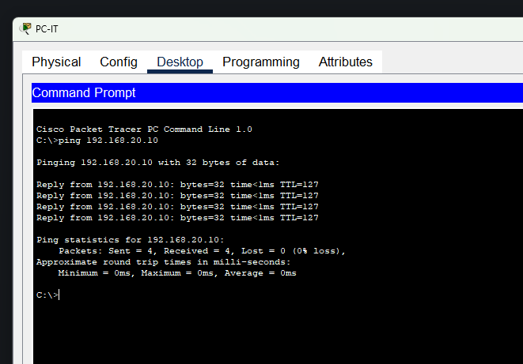
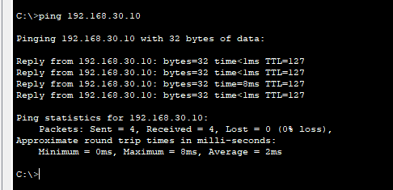
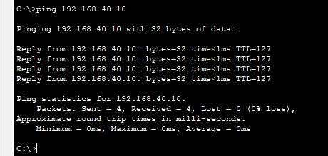
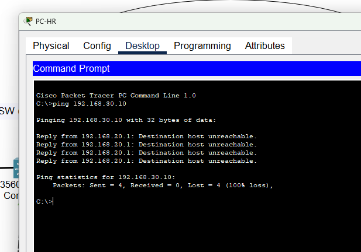
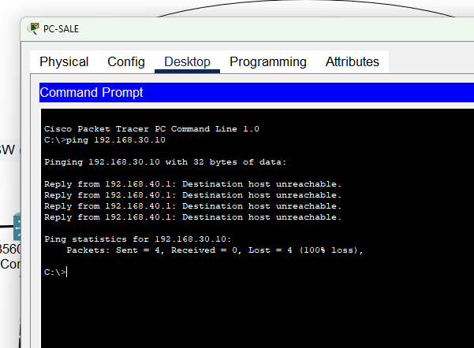
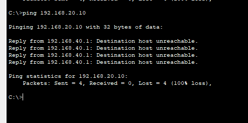

# Enterprise Network & Security Lab

## Giới thiệu

Dự án mô phỏng hệ thống mạng doanh nghiệp với nhiều phòng ban (IT, HR, FINANCE, SALE).  
Mục tiêu là xây dựng một kiến trúc mạng hoàn chỉnh với phân tách VLAN, định tuyến liên VLAN (Inter-VLAN Routing) và áp dụng các chính sách bảo mật bằng ACL và firewall.

---

## Topology

---

## Kiến trúc hệ thống

- Core Layer: Switch Layer 3 (Cisco 3560) thực hiện routing giữa các VLAN
- Access Layer: Switch Layer 2 (Cisco 2960) cho từng phòng ban
- Firewall: Cisco ASA kiểm soát truy cập giữa mạng nội bộ và router
- Router: Kết nối ra mạng ngoài

---

## Phân chia VLAN

| Phòng ban | VLAN | Subnet |
|----------|------|--------|
| IT       | 10   | 192.168.10.0/24 |
| HR       | 20   | 192.168.20.0/24 |
| FINANCE  | 30   | 192.168.30.0/24 |
| SALE     | 40   | 192.168.40.0/24 |

---

## Công nghệ sử dụng

- VLAN & Trunking (802.1Q)
- Inter-VLAN Routing (Layer 3 Switch)
- Static Routing
- Cisco ASA Firewall
- Access Control List (ACL)

---

## Chính sách bảo mật

- IT có thể truy cập tất cả các phòng ban
- HR không được truy cập FINANCE
- SALE không được truy cập HR và FINANCE
- Các truy cập bị chặn được thực hiện bằng ACL

---

## Kiểm thử hệ thống

### ✔ Truy cập hợp lệ

#### IT → HR

#### IT → FINANCE

#### IT → SALE

---

### ❌ Truy cập bị chặn (theo ACL)

#### HR → FINANCE

#### SALE → FINANCE

#### SALE → HR

---

## Định tuyến

- Core Switch thực hiện định tuyến giữa các VLAN
- Firewall định tuyến giữa mạng nội bộ và router
- Router sử dụng static route để truy cập các mạng nội bộ

---

## Kết quả đạt được

- Thiết kế thành công mô hình mạng doanh nghiệp cơ bản
- Phân tách VLAN rõ ràng giữa các phòng ban
- Thực hiện routing giữa các mạng nội bộ
- Áp dụng chính sách bảo mật bằng ACL
- Kiểm thử thành công cả trường hợp truy cập hợp lệ và bị chặn

---

## Mục tiêu học tập

Dự án giúp củng cố kiến thức về:

- Network Design
- VLAN & Routing
- Firewall & Security
- Phân tích và kiểm thử hệ thống mạng

---

## Tác giả

- Lê Đình Hòa
